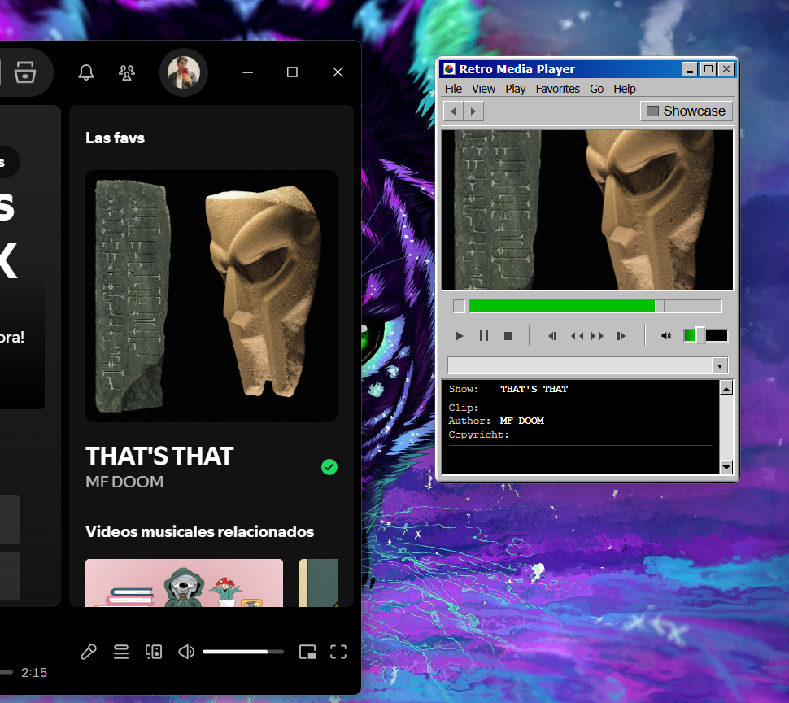
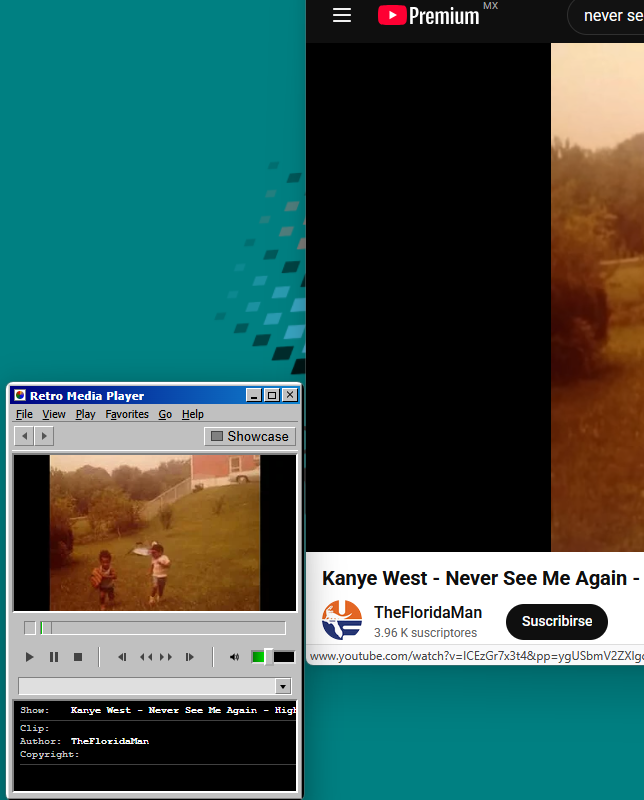
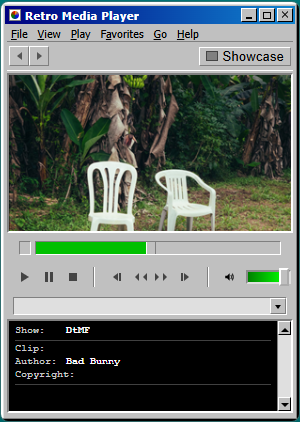

# Retro Media Player 📻

Una aplicación minimalista inspirada en la estética clásica de los reproductores de medios de los 90s (estilo Windows Media Player 6.4), diseñada para controlar la música de tu sistema con un toque retro.

## Introducción
**Retro Media Player** es un widget desarrollado con **Tauri** y **TypeScript** que permite gestionar la reproducción de medios directamente desde una interfaz nostálgica basada en windows98. Su objetivo es proporcionar un control ligero y visualmente atractivo que se integre perfectamente en tu escritorio.

## Funcionalidades
El widget ofrece un control total sobre las sesiones de medios activas en el sistema:

### 🎮 Controles de Reproducción
- **Play / Pause / Stop**: Control básico de reproducción.
- **Skip Back / Forward**: Salta a la pista anterior o siguiente.
- **Rewind / Fast Forward**: Retrocede o adelanta la pista actual.
- **Seek Bar**: Barra de progreso interactiva para desplazarse a cualquier punto de la canción.

### 🔊 Volumen
- **Slider de Volumen**: Ajuste preciso del volumen del sistema.
- **Mute / Unmute**: Botón de silencio rápido con indicador visual.

### 📝 Metadatos y Vistas
- **Visualización de Arte**: Muestra la carátula del álbum o una imagen por defecto.
- **Información del Track**: Muestra dinámicamente el título del "Show" (Canción) y el "Author" (Artista).
- **Interfaz Compacta**: Ventana personalizable con botones de minimizar y cerrar integrados en el diseño retro.

## Capturas
Aquí puedes ver cómo luce el widget controlando diferentes aplicaciones:

| Spotify | YouTube | Interfaz General |
| :---: | :---: | :---: |
|  |  |  |

## Instalación (Pendiente)

### Windows

Puedes descargar el archivo de instalación que se encuentra en la carpeta de ejecutables.

```
Ejecutable\Retro Media Player_0.1.0
```


> [!NOTE]
> Estamos trabajando en las versiones de Linux y MacOS

## Ejecutar el proyecto
Si deseas modificar el código o ejecutarlo en modo desarrollo, sigue estos pasos:

### Requisitos Previos
- [Node.js](https://nodejs.org/) (v18 o superior)
- [Rust](https://www.rust-lang.org/tools/install) y las herramientas de compilación de C++ (requerido por Tauri).

### Pasos
1. **Clonar el repositorio**:
   ```bash
   git clone https://github.com/brianpm141/Retrro-Media-Player.git
   cd Retrro-Media-Player
   ```

2. **Entrar a la carpeta del widget**:
   ```bash
   cd media-widget
   ```

3. **Instalar dependencias**:
   ```bash
   npm install
   ```

4. **Ejecutar en modo desarrollo**:
   ```bash
   npm run tauri dev
   ```
